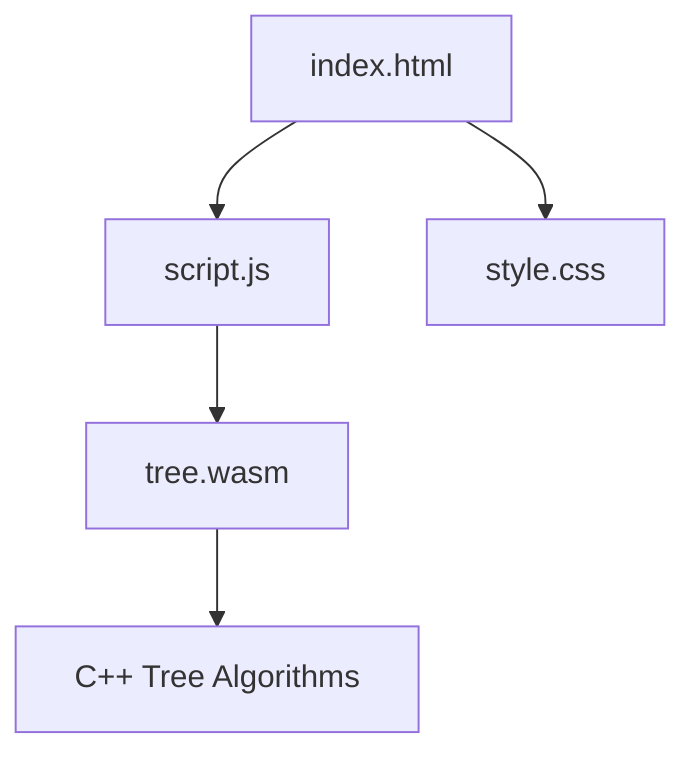

# Tree Traversal Visualizer

An interactive **Tree Traversal Visualizer** built using **C++**, **WebAssembly (WASM)**, **JavaScript**, **HTML**, and **CSS**. This project demonstrates Binary Search Tree (BST) traversal algorithms through an interactive web interface while executing the core logic in C++.

---

## Overview

The Tree Traversal Visualizer is an educational tool that helps users understand how tree traversal algorithms work. The core algorithms are implemented in **C++** and compiled to **WebAssembly**, allowing them to run efficiently inside a web browser.

---

## Features

* Binary Search Tree (BST) visualization
* Preorder Traversal
* Inorder Traversal
* Postorder Traversal
* Interactive visualization
* C++ algorithms executed using WebAssembly
* Responsive web interface

---

## Technologies Used

| Technology             | Purpose                              |
| ---------------------- | ------------------------------------ |
| **C++**                | Implements tree traversal algorithms |
| **WebAssembly (WASM)** | Executes C++ code in the browser     |
| **JavaScript**         | Connects the UI with WebAssembly     |
| **HTML5**              | Defines the application structure    |
| **CSS3**               | Styles the user interface            |

---

## Project Structure

```text
Tree-Traversal-Visualizer/
│
├── index.html
├── style.css
├── js/
│   └── script.js
├── cpp/
│   └── tree.cpp
├── wasm/
│   ├── tree.wasm
│   └── tree.js
├── app.py
├── requirements.txt
└── README.md
```

---

## Project Workflow



---

## How It Works

1. Open the application in a web browser.
2. `index.html` loads the user interface.
3. `script.js` loads the WebAssembly module.
4. The WebAssembly module executes the C++ traversal algorithms.
5. The traversal results are returned to JavaScript.
6. JavaScript updates the visualization in real time.

---

## How to Run the Project

### Run the Web Application

Clone the repository:

```bash
git clone https://github.com/mamatabalakatte/treetransversal.git
cd treetransversal
```

Start a local server:

```bash
python3 -m http.server 8000
```

Open your browser and visit:

```text
http://localhost:8000/
```

### Optional: Run the C++ Version

Compile the source code:

```bash
g++ main.cpp BST.cpp -o TreeVisualizer
```

Run the executable:

```bash
./TreeVisualizer
```

---

## Project Outcomes

### Tree Traversal Logic

* Implements Preorder, Inorder, and Postorder traversal.
* Demonstrates the order in which nodes are visited.

### Recursion

* Uses recursive functions to traverse binary trees.
* Demonstrates recursive processing of left and right subtrees.

### Hierarchical Data Representation

* Represents data using parent-child relationships.
* Visualizes the hierarchical structure of a binary tree.

### Algorithm Visualization

* Provides an interactive visualization of traversal execution.
* Helps users understand traversal step by step.

### WebAssembly Integration

* Executes C++ algorithms directly in the browser.
* Improves execution speed while keeping the interface interactive.

---

## Future Enhancements

* AVL Tree Visualization
* Red-Black Tree Visualization
* Trie Visualization
* Segment Tree Visualization
* Level Order Traversal
* Traversal Speed Controls
* Enhanced Animations
* Dark Mode Support

---

## Author

**Mamata Balakatte**

GitHub: **https://github.com/mamatabalakatte**

---

## License

This project is intended for educational and learning purposes.
